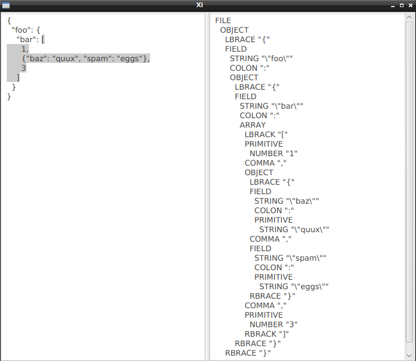

# Xi-editor + JavaFx + JSON parser

Super experimental JavaFx frontend for xi-editor.

# Running

You'll need git, JDK and hopefully nothing else to build and run xi-fx.

```
$ git clone https://github.com/matklad/xi-editor
$ cd xi-editor/rust && cargo build && cd ../../
$ git clone https://github.com/matklad/xi-fx
$ cd xi-fx && ./gradlew run
```

# Editing

Arrow keys, backspace and enter work. Everything else does not. You can use `Ctrl+W` key combination to expand selection.


